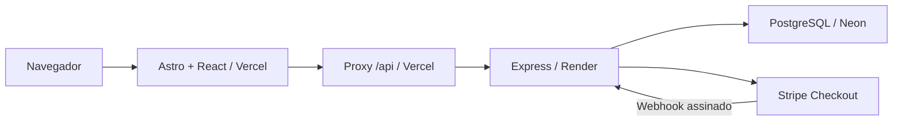

# Arquitetura e manutenção

A apresentação continua estática; as páginas de loja carregam componentes React que conversam com uma API separada. PostgreSQL é a fonte de verdade para clientes, estoque, pedidos e mensagens.

O proxy mantém cookies no domínio do site, evitando depender de cookies entre domínios. `BACKEND_URL` é uma variável privada da função Vercel. Segredos Stripe e conexão PostgreSQL existem somente no Render. As páginas administrativas são cascas públicas; todos os dados e operações passam pela autorização da API.

## Responsabilidades

| Pasta/arquivo | Responsabilidade |
| --- | --- |
| `src/content/` | Conteúdo institucional e portfólio; não contém preços da loja |
| `src/components/*.astro` | Seções institucionais e layout |
| `CreationGallery.tsx`, `gallery.css` | Galeria, filtros, animações e diálogo |
| `src/components/shop/ShopApp.tsx` | Sessão e carregamento inicial |
| `Store.tsx`, `AddressFields.tsx` | Catálogo, seleção, endereço e pedido |
| `Account.tsx`, `OrderPanel.tsx` | Pedidos, prazos, orçamento e conversa |
| `AdminProducts.tsx` | Cadastro e publicação de produtos |
| `api.ts`, `types.ts` | Cliente HTTP e contratos do frontend |
| `server/src/app.mjs` | Rotas HTTP, validação, autorização e respostas |
| `schemas.mjs` | Formatos aceitos pela API, definidos com Zod |
| `auth.mjs` | Senhas, sessões, papel administrativo e limites de requisição |
| `orders.mjs` | Transações de criação, reservas e histórico |
| `payments.mjs` | Checkout, confirmação, cancelamento e reconciliação |
| `maintenance.mjs` | Liberação de reservas sem tentativa de pagamento |
| `db.mjs`, `migrate.mjs` | Pool, transações e aplicação versionada do SQL |
| `config.mjs`, `index.mjs` | Ambiente, inicialização, manutenção e encerramento |
| `server/migrations/` | Estrutura versionada do PostgreSQL |
| `api/[...path].mjs` | Ponte privada entre Vercel e Render |
| `render.yaml`, `vercel.json` | Configuração de hospedagem |

## Decisões

- **Manter Astro:** preserva o site existente e entrega HTML estático; React cuida das telas com estado. Não precisamos trocar o projeto por outro framework.
- **SQL explícito + pg:** transações de estoque ficam visíveis e fáceis de auditar. Toda entrada variável usa parâmetros SQL. Não há ORM nem banco embutido.
- **Valores em centavos:** preço, quantidade e frete são recalculados no backend a partir do catálogo persistido. Pedidos guardam uma cópia do preço e título.
- **Sessões opacas em cookie:** o navegador não guarda tokens em localStorage. Revogação e mudança de papel têm efeito no servidor.
- **Checkout hospedado:** dados de cartão vão ao Stripe. A loja não coleta nem armazena número de cartão.
- **Chat por pedido:** mensagens persistidas, consultadas a cada 10 segundos enquanto a página está visível. Não há servidor WebSocket ou serviço extra.
- **Portfólio separado da loja:** adicionar foto à galeria não publica um produto com preço fictício.
- **Um workspace npm:** instalação e lockfile únicos, frontend e backend com comandos separados.

## Alterações e evolução

Para alterar regra comercial, acrescente um teste na API com banco `qalbi_test`. Para modificar estrutura depois da publicação, crie `002_descricao.sql`, depois `003_...`; nunca reescreva uma migration aplicada. A execução usa um lock transacional PostgreSQL para impedir duas instâncias de migrar juntas.

Execute `npm run validate`. Para layout, confira desktop, celular, teclado e preferência por movimento reduzido. A CI valida, mas proteção de branch e publicação dependem da configuração nas contas.

O build da Vercel é `dist/`. O Render executa Node com pool de até cinco conexões por instância. Arquivos gravados no disco do Render não são armazenamento durável; fotos ficam em `public/shop/` ou em uma URL HTTPS controlada pelo atelier. Operação e limites estão em [commerce.md](commerce.md); implantação e rollback, em [deployment.md](deployment.md).

A auditoria anterior em `audit.md` descreve a etapa da landing page, antes da introdução da loja.

## Conteúdo administrável da home

`server/src/home.mjs` mantém as rotas públicas e administrativas do conteúdo. A migration `002_home_content.sql` cria `home_content` (documento publicado com revisão) e `media` (imagens WebP). A gravação do documento verifica a revisão para impedir sobrescrita entre duas abas. Cards ocultos não entram na resposta pública.

`src/components/home/AdminHome.tsx` organiza seleção, edição e publicação; `PhotoField.tsx` prepara uploads e mostra a prévia. `PublishedGallery.tsx` usa a galeria existente para preservar recortes, animações, filtros, diálogos e botões. `load-home.ts` compartilha a consulta pública entre galeria e fotos principais. A página estática permanece como alternativa sem API/JavaScript; portanto alterações do banco não atualizam o HTML estático para indexadores que não executem JavaScript.

Fotos são reduzidas no navegador e revalidadas/reencodadas com Sharp no servidor, removendo metadados. São até 30 uploads por administrador/hora, entrada JSON de até 1 MB, limite de 16 milhões de pixels no servidor e saída de até 500 KB. As imagens são públicas, imutáveis por ID e cacheáveis. O proxy Vercel preserva bytes; conteúdo editorial e dados de conta não são cacheados. Monitorar o tamanho de `media` no Neon; não há limpeza automática de imagens órfãs nesta versão. Para bibliotecas grandes, migrar arquivos para armazenamento de objetos mantendo os identificadores/URLs.

## Identidade e área administrativa

`src/layouts/Admin.astro` e `src/components/admin/AdminApp.tsx` isolam a apresentação administrativa da loja. `/admin/login` usa credenciais de administrador; o formulário de cliente usa email ou telefone como identificador. A API valida o papel no login e novamente no acesso às rotas protegidas. O painel não precisa carregar o catálogo público para autenticar.

`003_customer_phone.sql` adiciona telefone opcional e único. `seed-admin.mjs` cria a primeira conta a partir do ambiente, com lock transacional e sem redefinir senha em cada startup. O comando `admin.mjs` permanece uma ferramenta explícita de manutenção. Nenhuma senha padrão ou credencial administrativa vai no bundle do frontend.
