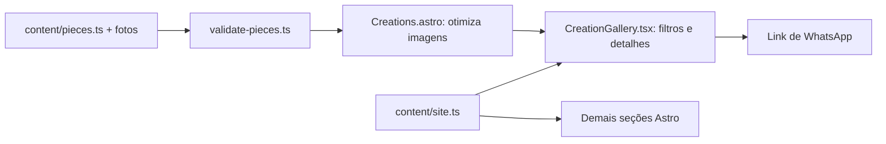

# Arquitetura e manutenção

Qalbi é uma landing page estática com uma galeria interativa. O objetivo da estrutura é permitir editar conteúdo sem mexer na lógica de interface e manter a operação simples.

## Caminho dos dados

A validação do catálogo e a otimização das imagens acontecem no build. O navegador recebe textos e URLs de imagens, sem metadados de importação do Astro. React é ativado quando a galeria se aproxima da área visível. O telefone de contato é público; não é um segredo.

## Onde cada responsabilidade fica

| Local | Responsabilidade | Quando editar |
| --- | --- | --- |
| `src/pages/index.astro` | Ordem das seções | Reorganizar a página |
| `src/layouts/Base.astro` | HTML, metadados, fontes e ligação dos efeitos da página | Alterar configuração compartilhada |
| `src/content/site.ts` | Contatos e mensagem de WhatsApp | Trocar número, endereço ou mensagem |
| `src/content/pieces.ts` | Cadastro das peças | Adicionar fotos e textos |
| `src/content/types.ts` | Contratos `Piece` e `GalleryPiece` | Acrescentar um campo ao cadastro |
| `src/content/validate-pieces.ts` | Regras que impedem cadastro inconsistente | Alterar regras do conteúdo |
| `src/components/Creations.astro` | Transformar originais em imagens leves | Ajustar tamanhos e formatos |
| `src/components/CreationGallery.tsx` | Estado do filtro, seleção, foco e diálogo | Alterar interação da galeria |
| `src/components/*.astro` | Seções e seus estilos locais | Alterar uma seção |
| `src/lib/reveal.ts` | Observação, movimento reduzido e limpeza das animações | Alterar o ciclo de vida dos efeitos |
| `src/styles/global.css` | Cores, fontes e elementos compartilhados | Alterar o sistema visual |
| `src/styles/gallery.css` | Cards, recortes responsivos e detalhes | Alterar a galeria |
| `tests/` | Regressões do conteúdo e dos links | Acrescentar regras verificáveis |
| `.github/workflows/quality.yml` | Verificações automáticas | Alterar a rotina de integração |

## Decisões

- **Astro + uma ilha React:** a página tem conteúdo estático e uma interação que precisa de estado. Não há necessidade atual de backend, banco de dados, roteador React, estado global ou outro framework.
- **Estilos perto das seções:** arquivos Astro incluem CSS local. O tamanho de `Hero.astro`, por exemplo, vem principalmente dos estilos responsivos; dividir esse arquivo só para reduzir linhas prejudicaria a localização do código.
- **Tipos separados do catálogo:** componentes React importam somente o contrato, sem depender do arquivo que carrega as fotos.
- **Um helper para três usos de animação:** títulos, seções e cards compartilham observação e movimento reduzido. Cada chamada ainda declara seu próprio efeito. O helper cancela apenas as animações que criou.
- **Diálogo mantido na galeria:** seleção e devolução do foco estão juntas. Extrair o diálogo agora exigiria passar referências e callbacks sem criar reutilização real.
- **Testes nativos do Node:** as regras de conteúdo e os links não exigem um framework de testes adicional. A inspeção visual no navegador complementa esses testes.

## Rotina de alteração

1. Para conteúdo, siga `comoadicionarfotos.md`.
2. Para uma regra nova, escreva um teste que demonstre o caso válido e o inválido.
3. Execute `npm run validate` e revise a diferença no Git.
4. Para interação ou CSS, confira também em largura móvel e desktop, com teclado e movimento reduzido.
5. Entregue a alteração em um commit focado; evite misturar atualização de dependências e redesign.

## Infraestrutura

O resultado é a pasta `dist/`, gerada por `npm run build`. Node é necessário para desenvolvimento e compilação, mas não para servir esses arquivos. A hospedagem precisa suportar site estático e HTTPS. Não use `astro dev` ou `astro preview` como servidor de produção.

A CI instala o lockfile com `npm ci`, usa a versão de `.nvmrc` e executa formatação, tipos, testes, build e auditoria de dependências. As actions estão fixadas por commit, com permissão somente de leitura e sem credenciais persistidas no checkout. A atualização dessas referências deve ser revisada, como qualquer dependência.

Ainda não há provedor de hospedagem ou domínio configurado. Ao defini-los: configurar domínio/canonical/sitemap/imagem social, HTTPS e headers compatíveis com o HTML gerado; validar cache (HTML revalidável e assets versionados de longa duração); configurar proteção de branch e escolher o check `quality`; documentar o rollback para a última publicação aprovada. O mecanismo exato depende do provedor. A CI atual valida, mas não faz deploy.

Referências oficiais consultadas: [publicação Astro](https://docs.astro.build/en/guides/deploy/), [setup-node](https://github.com/actions/setup-node), [checkout](https://github.com/actions/checkout), [TypeScript nativo no Node](https://nodejs.org/api/typescript.html).
